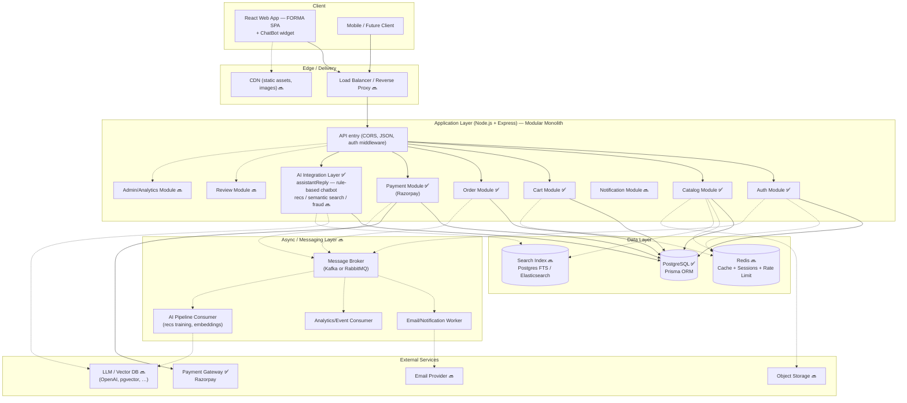

# Architecture — E-commerce Platform (10K Users Scale)

This document describes the system architecture for the FORMA e-commerce platform (PostgreSQL + Express + React + Node), sized for ~10,000 users. Caching (Redis), async messaging (Kafka/RabbitMQ), and deeper AI services can be added without restructuring the core system.

**Status legend used below:** ✅ implemented in the local MVP · 🔜 planned / reserved

---

## 1. Database choice: MongoDB vs PostgreSQL

**Decision: PostgreSQL** is the primary database (implemented via Prisma). Reasoning:

| Consideration | MongoDB | PostgreSQL |
|---|---|---|
| Orders/payments/inventory need strong consistency | Manual / multi-doc transactions | Native ACID + FKs — fits orders/payments/stock |
| Reporting / joins | Aggregation pipelines | Straightforward SQL |
| Flexible product attributes | Natural fit | Handled via `JSONB` columns |
| Tooling & migrations | Good | Excellent (Prisma migrations in this repo) |

Money, stock, and order relationships stay relational; loose fields (variant attrs, product specs, shipping address snapshots) use JSON. See `docs/DB_Schema.md` and `server/prisma/schema.prisma` for the live schema.

---

## 2. High-Level Architecture Diagram

Solid paths = live in the MVP. Dotted paths = reserved extension points (Redis, MQ, LLM, etc.).

---

## 3. What’s live vs planned

| Area | Status | Notes |
|---|---|---|
| Auth (JWT register/login/me + Google OAuth) | ✅ | Bearer token; roles `CUSTOMER` / `ADMIN`; Google Identity Services sign-in |
| Catalog (list, search, categories, detail) | ✅ | Prisma `contains` search |
| Cart | ✅ | Per logged-in user |
| Orders + Razorpay checkout | ✅ | Stock decremented after payment confirm |
| **AI chatbot (FORMA Assist)** | ✅ | `POST /api/ai/chat` + floating UI widget |
| Reviews / Admin UI / Email | 🔜 | Schema has `reviews`; APIs/UI TBD |
| Redis / Kafka / CDN / LB | 🔜 | Documented seams only |

---

## 4. Component Responsibilities

### 4.1 Client Layer ✅
- **React + Vite SPA** (`client/`): React Router, Auth/Cart context, pages for shop/cart/checkout/orders.
- **ChatBot widget** (`client/src/components/ChatBot.jsx`): floating panel on every page via `Layout`; calls `api.chat()`.
- Talks to the backend through `/api/...` (`VITE_API_URL`, default `http://localhost:5050/api`).

### 4.2 Edge Layer 🔜
- CDN for images/static assets; load balancer / Nginx for TLS and multi-instance routing — not required for local MVP.

### 4.3 Application Layer — Modular Monolith

One Express app (`server/src/index.js`), modules under `server/src/modules/`:

| Module | Path | Status |
|---|---|---|
| Auth | `/api/auth` | ✅ |
| Catalog | `/api/products` | ✅ |
| Cart | `/api/cart` | ✅ |
| Order | `/api/orders` | ✅ |
| Payment | `/api/payments` | ✅ |
| **AI** | `/api/ai` | ✅ |
| Review / Notify / Admin | — | 🔜 |

**AI Integration Layer (live stub → upgrade path)**  
- **Implemented:** `assistantReply(message)` in `server/src/modules/ai/assistant.js` — rule-based FAQ + catalog product lookup. Exposed as `POST /api/ai/chat` (optional JWT).  
- **Stable interface shape:** `{ reply, suggestions, products }` — UI depends only on this contract.  
- **Later swaps (no Catalog/Order rewrites):**
  - `assistantReply` → LLM provider
  - `getRecommendations(userId)` → ML / collaborative filtering
  - `semanticSearch(query)` → embeddings + vector store
  - fraud scoring on order/payment events

### 4.4 Data Layer
- **PostgreSQL ✅** — system of record (see `DB_Schema.md` / Prisma schema).
- **Redis 🔜** — cache-aside for catalog, sessions/rate limits when needed.
- **Search 🔜** — Postgres FTS or Elasticsearch; Catalog search stays behind a swappable function.

### 4.5 Async / Messaging 🔜
- Reserve domain events (`order.created`, `payment.succeeded`, `user.registered`, `product.viewed`, `chat.message` for future analytics).
- Introduce **RabbitMQ** for task queues or **Kafka** for event streams / AI training pipelines when direct in-process calls are no longer enough.

### 4.6 External Services
- **Razorpay ✅** — checkout + signature verification.
- Email, object storage, LLM/vector DB — reserved.

---

## 5. Request Flow Examples

### 5.1 Browsing products ✅
1. Client → `GET /api/products?category=...&q=...`
2. Catalog module queries PostgreSQL and returns mapped products.
3. *(Later)* check Redis cache key before DB; populate on miss.

### 5.2 Placing an order ✅
1. Checkout → Order module creates `PENDING` order + Razorpay order id.
2. Client pays via Razorpay Checkout.
3. Client → confirm-payment; Payment module verifies signature, marks `PAID`, decrements stock.
4. *(Later)* emit `payment.succeeded` → notification worker / AI pipeline.

### 5.3 Chatbot (FORMA Assist) ✅
1. User opens Chat widget → optional suggestion chip or free text.
2. Client → `POST /api/ai/chat` with `{ message }` (Bearer optional).
3. AI module runs `assistantReply`:
   - FAQ keyword match → canned support reply, **or**
   - Product intent (“show me lamp”) → Prisma catalog query → reply + product links.
4. Widget renders reply, suggestion chips, and links to `/product/:slug`.
5. *(Later)* same route calls an LLM; optionally persist turns in `chat_messages` and publish `chat.message` events.

### 5.4 Future: AI-powered recommendations 🔜
1. Order/catalog events published to Kafka.
2. AI worker updates embeddings / model.
3. `getRecommendations(userId)` swaps implementation; Catalog homepage only calls the interface.

---

## 6. Deployment Topology

**Local MVP (today)**
- `docker compose` → Postgres on `:5433`
- `npm run dev` → API `:5050` + Vite `:5173`
- No Redis / MQ / CDN

**At ~10K users (target)**
- 2–3 stateless Node instances behind a load balancer
- PostgreSQL primary (+ read replica if needed)
- Managed Redis; optional Kafka/RabbitMQ and AI workers as separate services
- Docker → Kubernetes/ECS only if ops demand it

---

## 7. Why this stays modular and AI-ready

- Domains live in separate route modules; AI already sits in its own folder (`modules/ai/`).
- Chat UI and Catalog never import each other’s internals — only the `/api/ai/chat` contract.
- Upgrading the bot to an LLM or adding recommendations means changing `assistant.js` (or adding sibling functions), not rewriting checkout.
- Redis and messaging remain swappable behind helpers/interfaces when introduced.
