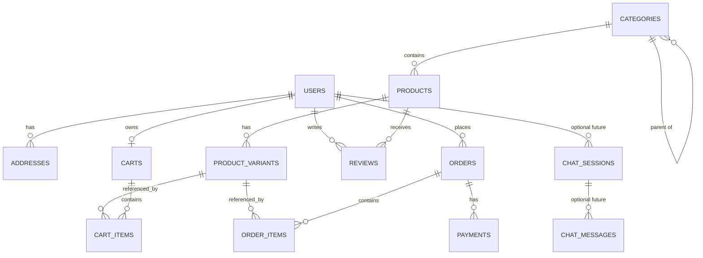

# Database Schema — E-commerce Platform

Primary database: **PostgreSQL** via Prisma (`server/prisma/schema.prisma`). This document mirrors the **live MVP schema**, notes simplifications vs the original long-term design, and reserves tables for chat history / caching / messaging when those layers are added.

See `docs/Architecture.md` for system context.

---

## 1. Entity Relationship Overview (implemented)



---

## 2. Implemented schema (matches Prisma)

Source of truth for migrations: `server/prisma/schema.prisma`. Money is stored as **integer minor units** (`*_cents`). Currency default: **INR**.

### 2.1 Enums

```sql
CREATE TYPE "Role" AS ENUM ('CUSTOMER', 'ADMIN');

CREATE TYPE "OrderStatus" AS ENUM (
  'PENDING', 'PAID', 'PROCESSING', 'SHIPPED', 'DELIVERED', 'CANCELLED'
);
```

### 2.2 Users & addresses

```sql
CREATE TABLE users (
    id              UUID PRIMARY KEY DEFAULT gen_random_uuid(),
    email           VARCHAR(255) UNIQUE NOT NULL,
    password_hash   TEXT,                        -- nullable: Google-only accounts have no password
    google_id       TEXT UNIQUE,                  -- Google "sub" claim, nullable
    avatar_url      TEXT,                         -- from Google profile picture, nullable
    full_name       TEXT NOT NULL,
    phone           TEXT,
    role            "Role" NOT NULL DEFAULT 'CUSTOMER',
    is_active       BOOLEAN NOT NULL DEFAULT TRUE,
    created_at      TIMESTAMPTZ NOT NULL DEFAULT now(),
    updated_at      TIMESTAMPTZ NOT NULL
);

CREATE TABLE addresses (
    id            UUID PRIMARY KEY DEFAULT gen_random_uuid(),
    user_id       UUID NOT NULL REFERENCES users(id) ON DELETE CASCADE,
    label         TEXT,
    full_name     TEXT NOT NULL,
    phone         TEXT NOT NULL,
    line1         TEXT NOT NULL,
    line2         TEXT,
    city          TEXT NOT NULL,
    state         TEXT,
    postal_code   TEXT NOT NULL,
    country       TEXT NOT NULL DEFAULT 'IN',
    is_default    BOOLEAN NOT NULL DEFAULT FALSE
);
```

### 2.3 Catalog

Stock lives on **`product_variants.stock_qty`** (no separate inventory table in the MVP). Primary image is **`products.image_url`** (no `product_images` table yet).

```sql
CREATE TABLE categories (
    id          UUID PRIMARY KEY DEFAULT gen_random_uuid(),
    name        TEXT NOT NULL,
    slug        TEXT UNIQUE NOT NULL,
    parent_id   UUID REFERENCES categories(id),
    created_at  TIMESTAMPTZ NOT NULL DEFAULT now()
);

CREATE TABLE products (
    id               UUID PRIMARY KEY DEFAULT gen_random_uuid(),
    category_id      UUID REFERENCES categories(id),
    name             TEXT NOT NULL,
    slug             TEXT UNIQUE NOT NULL,
    description      TEXT,
    brand            TEXT,
    base_price_cents INTEGER NOT NULL,
    currency         TEXT NOT NULL DEFAULT 'INR',
    attributes       JSONB NOT NULL DEFAULT '{}',
    is_published     BOOLEAN NOT NULL DEFAULT TRUE,
    avg_rating       DOUBLE PRECISION NOT NULL DEFAULT 0,
    review_count     INTEGER NOT NULL DEFAULT 0,
    image_url        TEXT,
    created_at       TIMESTAMPTZ NOT NULL DEFAULT now(),
    updated_at       TIMESTAMPTZ NOT NULL
);

CREATE TABLE product_variants (
    id            UUID PRIMARY KEY DEFAULT gen_random_uuid(),
    product_id    UUID NOT NULL REFERENCES products(id) ON DELETE CASCADE,
    sku           TEXT UNIQUE NOT NULL,
    variant_attrs JSONB NOT NULL DEFAULT '{}',   -- e.g. {"size":"M","color":"Red"}
    price_cents   INTEGER NOT NULL,
    stock_qty     INTEGER NOT NULL DEFAULT 0
);
```

### 2.4 Cart

One cart per user (`user_id` unique). Guest carts are not persisted yet (auth required for cart APIs).

```sql
CREATE TABLE carts (
    id          UUID PRIMARY KEY DEFAULT gen_random_uuid(),
    user_id     UUID UNIQUE NOT NULL REFERENCES users(id) ON DELETE CASCADE,
    created_at  TIMESTAMPTZ NOT NULL DEFAULT now(),
    updated_at  TIMESTAMPTZ NOT NULL
);

CREATE TABLE cart_items (
    id          UUID PRIMARY KEY DEFAULT gen_random_uuid(),
    cart_id     UUID NOT NULL REFERENCES carts(id) ON DELETE CASCADE,
    variant_id  UUID NOT NULL REFERENCES product_variants(id),
    quantity    INTEGER NOT NULL,
    UNIQUE (cart_id, variant_id)
);
```

### 2.5 Orders & payments

Shipping address is a **JSONB snapshot** on the order (immutable at place time). Razorpay order id stored for checkout correlation.

```sql
CREATE TABLE orders (
    id                 UUID PRIMARY KEY DEFAULT gen_random_uuid(),
    user_id            UUID NOT NULL REFERENCES users(id),
    status             "OrderStatus" NOT NULL DEFAULT 'PENDING',
    subtotal_cents     INTEGER NOT NULL,
    shipping_cents     INTEGER NOT NULL DEFAULT 0,
    tax_cents          INTEGER NOT NULL DEFAULT 0,
    total_cents        INTEGER NOT NULL,
    currency           TEXT NOT NULL DEFAULT 'INR',
    shipping_address   JSONB NOT NULL,
    razorpay_order_id  TEXT UNIQUE,
    placed_at          TIMESTAMPTZ NOT NULL DEFAULT now(),
    updated_at         TIMESTAMPTZ NOT NULL
);

CREATE TABLE order_items (
    id               UUID PRIMARY KEY DEFAULT gen_random_uuid(),
    order_id         UUID NOT NULL REFERENCES orders(id) ON DELETE CASCADE,
    variant_id       UUID NOT NULL REFERENCES product_variants(id),
    product_name     TEXT NOT NULL,          -- snapshot
    variant_attrs    JSONB NOT NULL DEFAULT '{}',
    unit_price_cents INTEGER NOT NULL,       -- snapshot
    quantity         INTEGER NOT NULL,
    line_total_cents INTEGER NOT NULL
);

CREATE TABLE payments (
    id                   UUID PRIMARY KEY DEFAULT gen_random_uuid(),
    order_id             UUID NOT NULL REFERENCES orders(id) ON DELETE CASCADE,
    provider             TEXT NOT NULL DEFAULT 'razorpay',
    provider_payment_id  TEXT NOT NULL,
    amount_cents         INTEGER NOT NULL,
    currency             TEXT NOT NULL,
    status               TEXT NOT NULL,       -- e.g. SUCCEEDED
    raw_response         JSONB,
    created_at           TIMESTAMPTZ NOT NULL DEFAULT now(),
    UNIQUE (provider, provider_payment_id)
);
```

### 2.6 Reviews (table exists; storefront APIs TBD)

```sql
CREATE TABLE reviews (
    id          UUID PRIMARY KEY DEFAULT gen_random_uuid(),
    product_id  UUID NOT NULL REFERENCES products(id) ON DELETE CASCADE,
    user_id     UUID NOT NULL REFERENCES users(id) ON DELETE CASCADE,
    rating      INTEGER NOT NULL,
    title       TEXT,
    body        TEXT,
    created_at  TIMESTAMPTZ NOT NULL DEFAULT now(),
    UNIQUE (product_id, user_id)
);
```

---

## 3. AI chatbot & data

### 3.1 Current behavior (stateless) ✅

FORMA Assist does **not** persist chat turns today.

- Endpoint: `POST /api/ai/chat` → `{ message }`
- Response: `{ reply, suggestions[], products[] }`
- Product answers are read-only queries against `products` / `categories` / `product_variants` (same catalog tables).
- FAQ answers are in-code rules in `server/src/modules/ai/assistant.js`.

No dedicated chat tables are required for the MVP.

### 3.2 Optional future: chat persistence 🔜

Add when you need history, analytics, or LLM context windows:

```sql
CREATE TABLE chat_sessions (
    id          UUID PRIMARY KEY DEFAULT gen_random_uuid(),
    user_id     UUID REFERENCES users(id) ON DELETE SET NULL,  -- null = guest
    created_at  TIMESTAMPTZ NOT NULL DEFAULT now(),
    updated_at  TIMESTAMPTZ NOT NULL DEFAULT now()
);

CREATE TABLE chat_messages (
    id          UUID PRIMARY KEY DEFAULT gen_random_uuid(),
    session_id  UUID NOT NULL REFERENCES chat_sessions(id) ON DELETE CASCADE,
    role        VARCHAR(20) NOT NULL,   -- 'user' | 'assistant' | 'system'
    content     TEXT NOT NULL,
    metadata    JSONB DEFAULT '{}',     -- matched products, model name, tokens, etc.
    created_at  TIMESTAMPTZ NOT NULL DEFAULT now()
);

CREATE INDEX idx_chat_messages_session ON chat_messages(session_id);
CREATE INDEX idx_chat_sessions_user ON chat_sessions(user_id);
```

For semantic search / recommendations later, consider **`pgvector`** embeddings on products (or a separate vector store) without changing order/payment tables.

---

## 4. Planned tables (not in Prisma yet)

Keep these for the longer-term design; introduce via new Prisma migrations when needed:

| Table / concern | Purpose |
|---|---|
| `refresh_tokens` | Rotating refresh tokens / logout |
| `product_images` | Multi-image gallery |
| `inventory` (or keep `stock_qty`) | Reserved qty, low-stock thresholds |
| `coupons` | Discount codes |
| `order_status_history` | Audit trail of status changes |
| `audit_logs` | Admin action log |
| `chat_sessions` / `chat_messages` | Persist FORMA Assist conversations |

---

## 5. Redis key design 🔜

| Purpose | Key pattern | TTL |
|---|---|---|
| Product listing cache | `cache:products:{category}:{page}:{sort}` | 60–300s |
| Product detail | `cache:product:{productId}` | ~300s |
| Rate limit (auth / chat) | `ratelimit:{ip}:{route}` | sliding window |
| Chat rate limit | `ratelimit:chat:{userOrIp}` | e.g. 60s |

Invalidate catalog keys on product writes, or rely on short TTLs at this scale.

---

## 6. Message queue event shapes 🔜

```json
{
  "eventType": "order.created",
  "eventId": "uuid",
  "occurredAt": "2026-08-21T10:00:00Z",
  "payload": {
    "orderId": "uuid",
    "userId": "uuid",
    "totalCents": 4999,
    "items": [{ "variantId": "uuid", "quantity": 2 }]
  }
}
```

Suggested topics when Kafka/RabbitMQ is introduced:
- `order.created`, `order.status_changed`
- `payment.succeeded`, `payment.failed`
- `user.registered`
- `product.viewed` (recs / AI training)
- `chat.message` (assistant analytics, optional)

---

## 7. MVP vs earlier design — deltas

| Earlier design doc | Live MVP |
|---|---|
| Roles `customer` / `seller` / `admin` | `CUSTOMER` / `ADMIN` |
| Separate `inventory` + `product_images` | `stock_qty` on variant; `image_url` on product |
| Coupons, refresh tokens, status history, audit logs | Deferred |
| Currency default USD | **INR** + Razorpay |
| Password-only auth | **Password + Google OAuth** (`google_id`, `avatar_url`, nullable `password_hash`) |
| AI as future-only | **Chatbot live** (stateless); chat tables optional |
| Mongo sketch as alternative | Postgres chosen and implemented |

Prisma remains the migration authority — update this file when `schema.prisma` changes.
